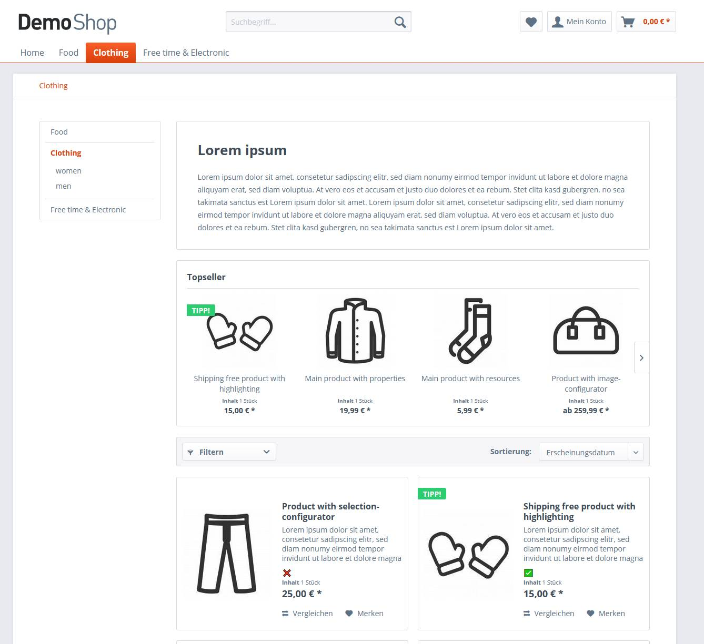

# Shopware Test Plugin
## setting my_attribute for a specific main article over the shopware api:
##### ENDPOINT:
`PUT http://example.com/api/articles/{articleId}`

##### PAYLOAD:
```json
{
	"mainDetail": {
		"attribute": {
			"myAttribute": true
		}
	}
}
```
## preview of installed plugin:
